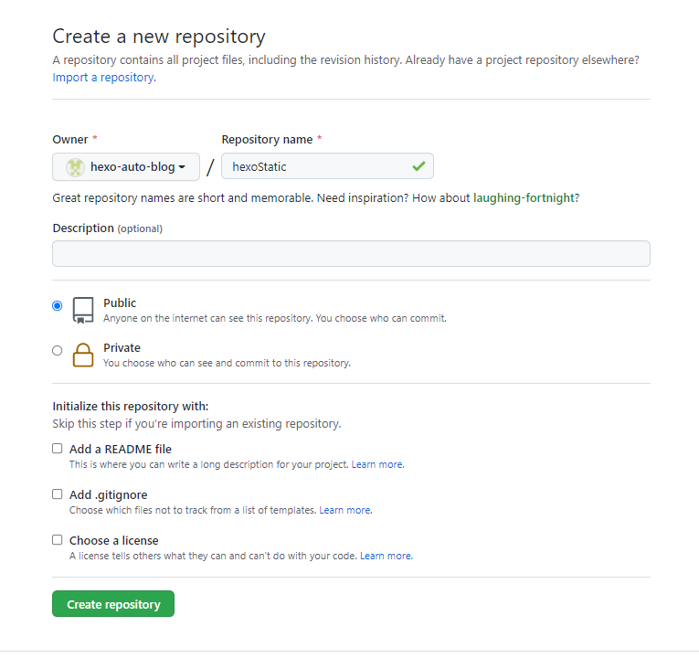
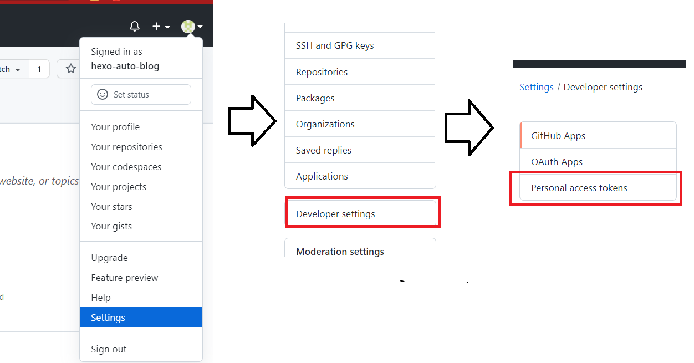
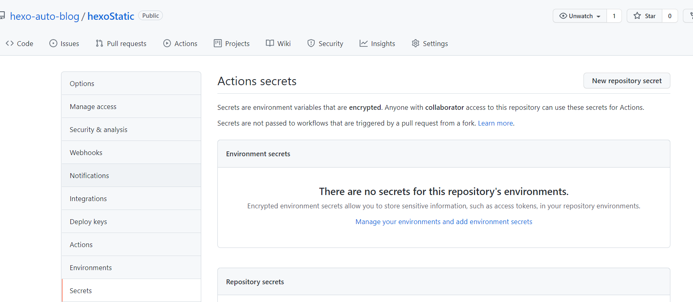
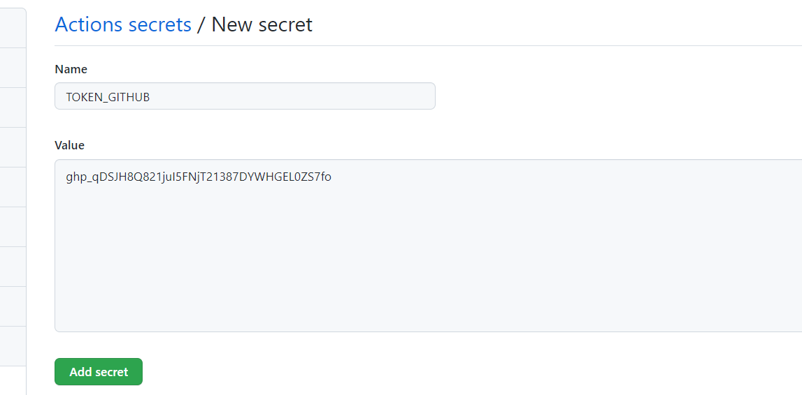
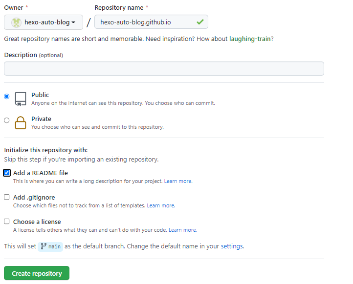
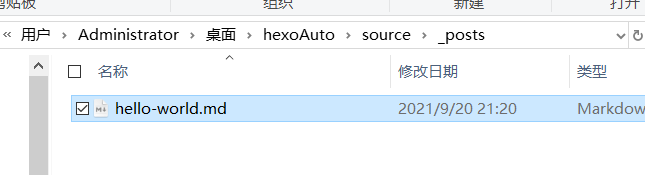
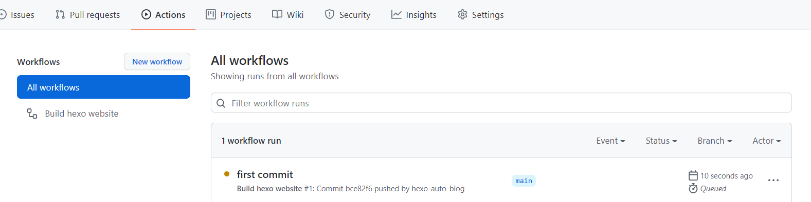

# hexoAuto
> 这篇文章介绍了，如何使用github Action进行自动化渲染部署，本地所需要做的就是将静态文件push到对应的git仓库即可

# 前期准备

> 这里做的就是创建了一个用来存储静态文件的仓库，自动push静态文件上去就会触发github Action从而渲染文章到静态网页仓库

## 创建静态文件仓库

这里选择创建`hexoStatic`仓库



### 创建token

按照下图选择，最后选择`Generate new token`



选择如下权限


**PS**：创建成功后需要复制这个token

**官网教程**：[创建个人访问令牌](https://docs.github.com/cn/github/authenticating-to-github/keeping-your-account-and-data-secure/creating-a-personal-access-token)

### 使用token

选中创建的项目，

```
setting =>Secrets
```



点击`New repository secret`，将之前复制的token放置其中。Name一定要使用`TOKEN_GITHUB`



### 拉取项目

**拉取项目**

```
git clone git@github.com:hexo-auto-blog/hexoAuto.git
cd hexoAuto
```

**建立远程连接**

```
git remote add staticrep git@github.com:hexo-auto-blog/hexoStatic.git
```

## 创建静态网页仓库

因为我们需要使用Action进行hexo的渲染部署，那么渲染之后肯定需要将渲染生成的html文章部署到一个静态仓库中。这里就需要创建一个静态仓库。这里选择的是`hexo-auto-blog.github.io`

**PS**：确保创建的时候勾选了README。因为这样子才能保证创建仓库之后自动创建main分支




## 小结

前期准备一共干了三件事情

+ 创建了一个仓库用来存储hexo静态md文件，并且同时拉取了`hexoAuto`到本地。并且与前面创建的仓库建立了远程连接；
+ 创建一个仓库用于存储hexo渲染之后的html文件存储仓库；
+ 创建一个token，给github Action使用。从而可以使得Action具有相关的权限；

# 修改配置文件

修改这个文件`hexoAuto\.github\workflows`中的2块地方

```yaml
name: Build hexo website
on: push
jobs:
  hexo-build:
    runs-on: ubuntu-20.04
    steps:
      - name: Clone blog source repository
        uses: actions/checkout@v2
        with:
          path: hexo

      - name: Checkout blog web site repo
        uses: actions/checkout@v2
        with:
          token: ${{ secrets.TOKEN_GITHUB }}
          fetch-depth: 0
          repository: ${{ github.repository_owner }}/hexo-auto-blog.github.io # 静态网页仓库名
          path: site

      - name: Config git user and user.email
        run: |
          cd ${GITHUB_WORKSPACE}/site && git config user.name github-actions
          cd ${GITHUB_WORKSPACE}/site && git config user.email tx943lvwo312@163.com # 改成自己的邮箱

      - name: Init hexo env
        run: |
          sudo apt install rename -y -qq
          sudo yarn global add hexo-cli
          cd ${GITHUB_WORKSPACE}/hexo && yarn install

      - name: Hexo build
        run: |
          cd ${GITHUB_WORKSPACE}/hexo/source/_posts && rename 's/([12]\d{3}-(0[1-9]|1[0-2])-(0[1-9]|[12]\d|3[01])-)//' *.md
          cd ${GITHUB_WORKSPACE}/hexo && hexo clean && hexo g
          cd ${GITHUB_WORKSPACE}/hexo && git checkout .

      - name: Update repo
        run: |
          cp -rf ${GITHUB_WORKSPACE}/hexo/public/* ${GITHUB_WORKSPACE}/site
          cd ${GITHUB_WORKSPACE}/site && git add . && git commit -am "Auto build by GitHub Actions $(date)"
          cd ${GITHUB_WORKSPACE}/site && git push origin -f
```

上面有注释的地方需要修改

# push文章

在`source\_posts`中写文章。这里内置了一篇文章



将这篇文章push到云端。

```
git add .
git commit -m "first commit"
git push staticrep main
```


可以看到Action已经在运行了。




等待运行结束之后

# 最后结果


# 参考文献

+ [https://github.com/sujit-168/My_Blog](https://github.com/sujit-168/My_Blog)
+ [https://github.com/muzi502/blog](https://github.com/muzi502/blog)


